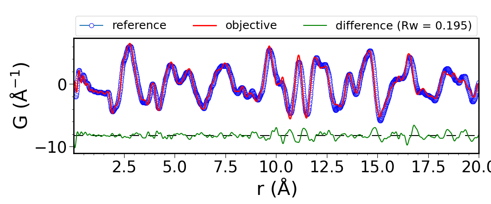
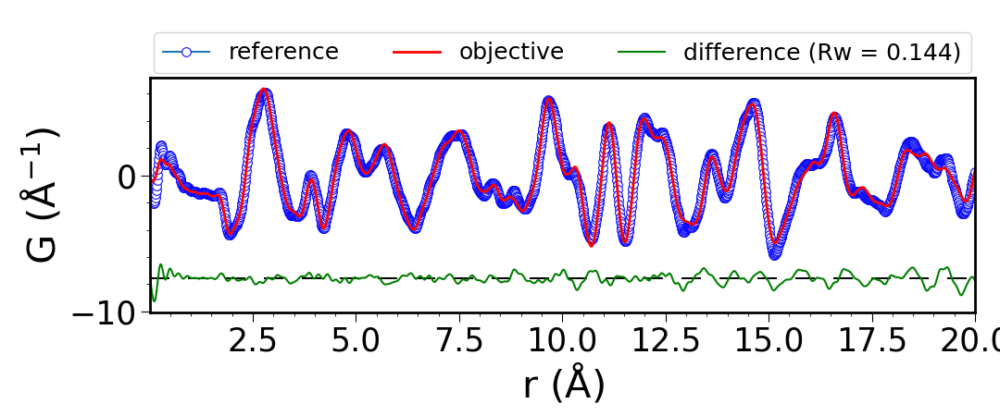
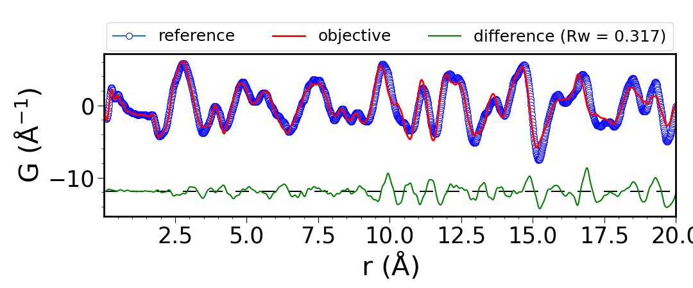
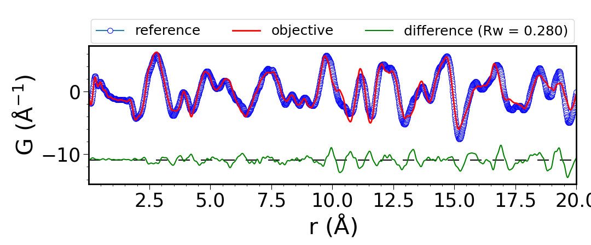
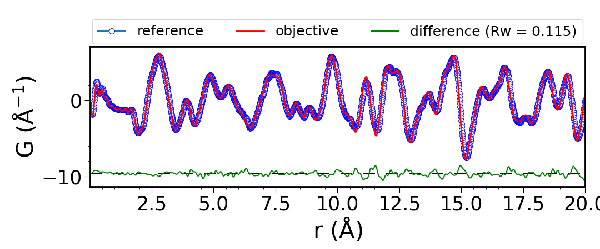
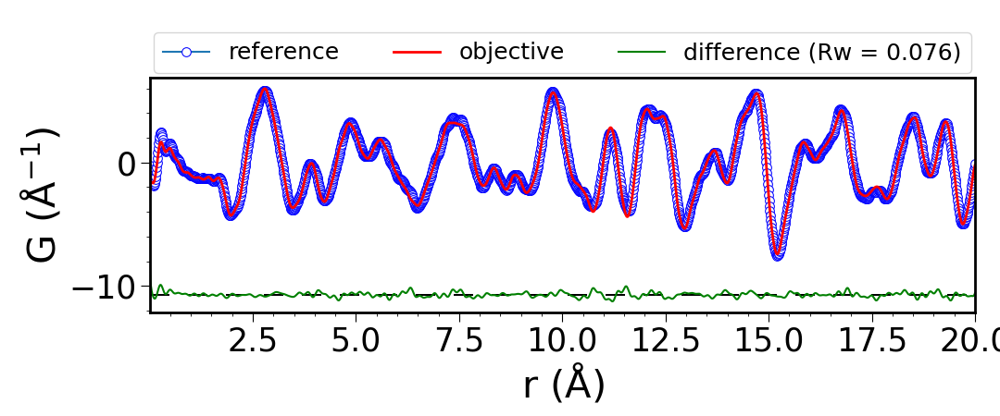

.. image:: https://travis-ci.org/diffpy/diffpy.pdfmorph.svg?branch=master
   :target: https://travis-ci.org/diffpy/diffpy.pdfmorph

.. image:: http://codecov.io/github/diffpy/diffpy.pdfmorph/coverage.svg?branch=master
   :target: http://codecov.io/github/diffpy/diffpy.pdfmorph?branch=master

PDFmorph Examples
========================================================================

After installing PDFmorph, we'll want to run some examples to show how it
works and how to use it. If you have not yet go back and read the README.

LICENSE
------------------------------------------------------------------------

This software is subject to license and copyright restrictions listed
`here. <https://github.com/diffpy/diffpy.pdfmorph/blob/master/LICENSE.txt/>`_

Temp Examples
------------------------------------------------------------------------

We will start with SrFe2As2 data provided. First, lets just compare some PDFs
without doing any morphing by simply using ::

    pdfmorph 550K.gr 700K.gr

By inputting two PDF files without providing any parameters PDFmorph will simply
compare the two and create a difference plot.

Now lets see if any phase transitions occur between these two temperatures,
this may take some fiddling with some morphing parameter estimates. We can
see that these two PDFs are rather close, so lets use initial guesses
assuming that. ::

    pdfmorph 550K.gr 700K.gr --stretch=0.01 --scale=1.0 --smear=0.01

``Note: If you get something that looks drastically different with an Rw of
almost 1, then one of the parameters was a bad guess.``

As you can see, the Rw or difference between the two PDFs dropped from
0.195 to 0.144 and the two plots line up better with each other. For
more details on what stretch, scale, and smear do, refer to the help menu. ::

    pdfmorph -h

Now, does this mean that a phase transition occurred or not? We can't say
definitively yet. Lets try some other temperature ranges the same way we
did the lase two. ::

    pdfmorph 700K.gr 880K.gr

\

and morphed ::

    pdfmorph 700K.gr 880K.gr --stretch=0.01 --scale=1.0 --smear=0.01

Now we see a rather small difference (proportionally) between the unmorphed
and morphed ~11.6% decrease compared to ~26.2% from before, we can also see
that there is some mismatch that morphing can't seem to remove, this is more
interesting but not necessarily definitive.

Lets look at 1 more example to see if we can find where the phase transition
(if there is one) occurs. ::

    pdfmorph 740K.gr 880K.gr

\

and morphed ::

    pdfmorph 740K.gr 880K.gr --stretch=0.01 --scale=1.0 --smear=0.01

This time we again see a more significant drop in Rw (~33.9%) from an already
low value which suggests that both of these PDFs are the same phase and the
differences are mostly from natural thermal effects and measurement scaling.

Combining these 3 examples, they suggest there's a phase transition somewhere
between 700K and 740K, which in fact there is at around 730K.

Use these methods to try and find the 2nd phase transition in this data set at
a higher temperature.

Another good resource to help narrow down where to look for phase
transitions occur can be found `here`_. Uploading the dataset provided and
checking for similar temperature ranges and where there's differences can
give suggestions for where to look and potential outlying data.

.. _here: https://pdfitc.org/pearson

If you're feeling adventurous, there's also SrFe2As2 data provided which has
a phase transition but is harder to find due to smaller differences.

